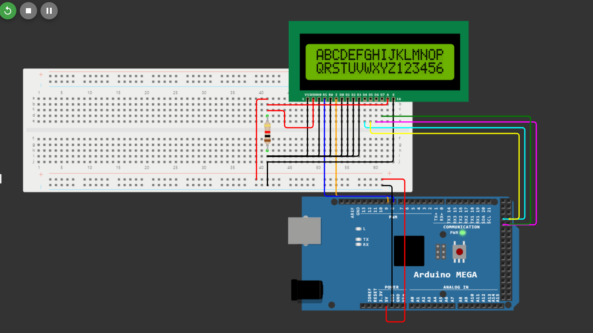

# ACTIVATING A 16x2 LIQUID CRYSTAL DISPLAY

In this guide, we will discuss how to activate a 16x2 Liquid Crystal Display (LCD) using a 4-bit data configuration. It's worth noting that employing 8 bits for a 16x2 LCD is not recommended due to the excessive use of pins and complexity. Using 4 bits for data transmission not only conserves microcontroller I/O pins for other purposes but also reduces the number of tracks needed on the printed circuit board. The only trade-off is a slightly more complex control program for the LCD, which consumes a few extra bytes of memory.

## Steps for Interacting with the LCD Display Using a 4-Bit Data Path

1. Set the R/W (Read/Write) pin to logic 0 if you intend to write data to the LCD or logic 1 if you plan to read from it. Ground this pin if you do not need to monitor the LCD's response (which is the most common scenario).

2. Adjust the RS (Register Select) pin to logic level 0 for instruction mode or logic level 1 for character mode.

3. Transmit the most significant part of the data to the data lane (the 4 most significant bits or MSB, also known as the largest nibble).

4. Generate an enable pulse. This means setting the E (Enable) pin to logic 1 and then, after a brief delay, returning it to logic 0.

5. Transfer the least significant part of the data to the data lane (the 4 least significant bits or LSB, also known as the smallest nibble).

6. Generate another enable pulse.

7. Implement a delay routine between instructions or check the busy flag (bit 7 of the data line) before sending instructions. Send instructions only when this flag is logical 0, indicating that the display is not busy.

## Additional Information
- Use a register for the 4 LCD data bits (PA4-D4, PA5-D5, PA6-D6, PA7-D7).
- Utilize an H register for LCD control pins (Enable - PH6 and RS - PH5).
- The LCD IC model is HD44780.
- This guide assumes you are using an Arduino Mega ATMega 2560 microcontroller.

### Corresponding LCD Addresses

| -     | 1  | 2  | 3  | 4  | 5  | 6  | 7  | 8  | 9  | 10 | 11 | 12 | 13 | 14 | 15 | 16 |
|-------|----|----|----|----|----|----|----|----|----|----|----|----|----|----|----|----|
| Row 1 | 80 | 81 | 82 | 83 | 84 | 85 | 86 | 87 | 88 | 89 | 8A | 8B | 8C | 8D | 8E | 8F |
| Row 2 | C0 | C1 | C2 | C3 | C4 | C5 | C6 | C7 | C8 | C9 | CA | CB | CC | CD | CE | CF |

## Project Preview

[View on Wokwi](https://wokwi.com/projects/377328954945678337).

This guide provides a clear and concise overview of activating a 16x2 LCD using a 4-bit data path while highlighting key considerations and providing additional information for reference.